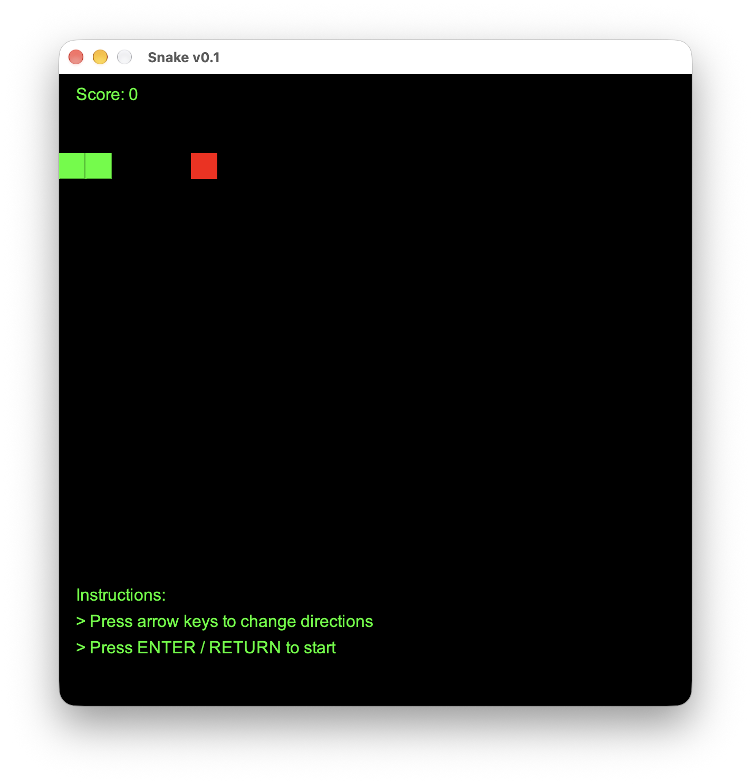
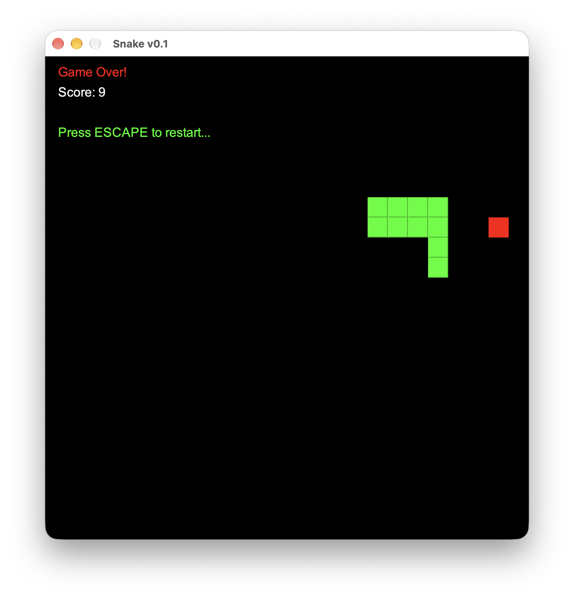

# Snake 
#### Built in Java.

## Description
A classic Snake game implemented in Java. The game features a snake that moves around the screen, eating food to grow longer. The player controls the snake using the arrow keys. Aim is to achieve the highest score possible without colliding with the walls or the snake's own body.

## How to Play?
1. Use the arrow keys to control the direction of the snake.
2. Eat the food that appears on the screen to grow longer.
3. Avoid running into the walls or the snake's own body, as this will end the game.
4. High scores are recorded, so try to beat your previous best!

## How to Run?
Make sure you have Java Runtime Environment (JRE) OR Java Development Kit (JDK) installed on your machine. You can download it from the official Oracle website. 

Just download the current released version and run it.

## How to build?
Work in Progress ... 

 
## Credits
Guide: [Kenny Yip Coding : YouTube](https://youtu.be/Y62MJny9LHg)